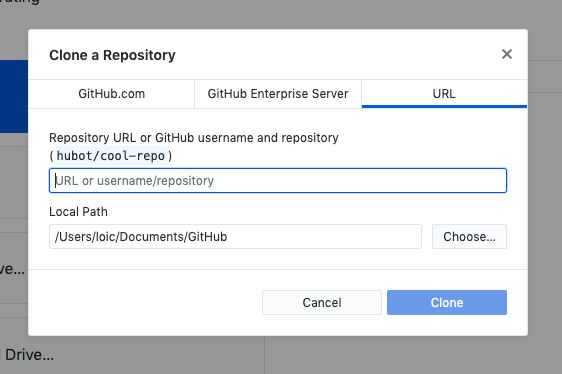

# Switch

To run simulations, you must first install GAMA, then import the model from git, and finally run an experiment.

## Installation of GAMA
To run simulations, you have to use the last version of gama (git version or continuous build)
* continuous build: just download the version of gama (with jdk) corresponding to your operating system (windows, mac os or Linux) from this [site](https://github.com/gama-platform/gama/releases/tag/continuous), then unzip the downloaded zip archive. Launching GAMA then just consists in double-clicking on the GAMA icon whose directory is created.
* developer version: follow the instruction given on this [page](https://github.com/gama-platform/gama/wiki/InstallingGitVersion)

## Importing the model from git
1. First, install github Desktop from this [site] (https://desktop.github.com/). As github Desktop is only available on MacOS and Windows, if you are running a linux distribution a good alternative is [gitKraken] (https://www.gitkraken.com/) 

2. Launch github Desktop

3. In the file menu, choose "clone repository", then in the URL panel, in the "URL repisitory" field, write "https://github.com/ANR-Switch/Switch.git", then push the clone button

4. To update the switch model, just click on the "Fetch origin" button

## Importing the model in GAMA
1. Launch GAMA
2. Follow these [instructions](https://gama-platform.github.io/wiki/ImportingModels) to import the switch project (that should be located in the Github folder). If you want to be able to update the model, "copy projects into workspace" has to be unchecked.

## Run an experiment
1. Once the project has been added to GAMA (in "User model"), open the file "Basic experiment.gaml" in the Experiments folder (in the SWITCH Model project) by double-cliking on it. 
2. Click on the green button "Basic experiment", for more details on launching experiments see this [page](https://gama-platform.github.io/wiki/LaunchingExperiments)

